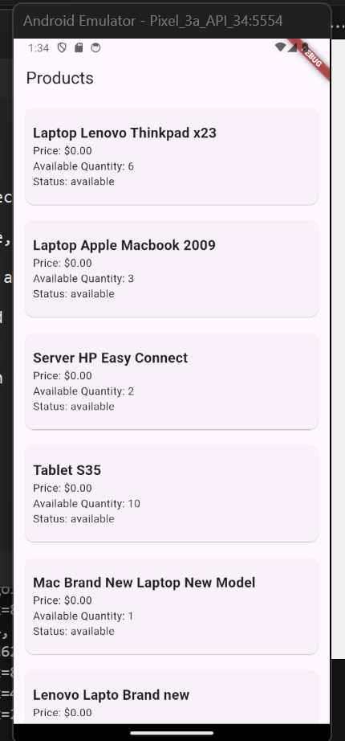
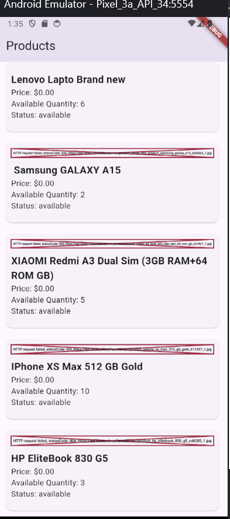

   

  <h3><b>Timbu Product Viewer README</b></h3>

# 📗 Table of Contents

- [📖 About the Project](#about-project)
  - [🛠 Built With](#built-with)
    - [Tech Stack](#tech-stack)
    - [Key Features](#key-features)
- [💻 Getting Started](#getting-started)
  - [Setup Instructions](#setup)
  - [Prerequisites](#prerequisites)
  - [Screenshots](#screenshots)
  - [APK Download link](#apk-download)
  - [Appetize showcase](#appetize-showcase)
- [👥 Authors](#authors)
- [🔭 Future Features](#future-features)
- [🤝 Contributing](#contributing)
- [⭐️ Show your support](#support)
- [🙏 Acknowledgements](#acknowledgements)
- [❓ FAQ ](#faq)
- [📝 License](#license)

# 📖 Timbu Product Viewer 

 **Timbu Product Viewer** is a mobile app that integrates with the Timbu API to display product information.

## 🛠 Built With 

### Tech Stack 

  
Dart

  <ul>
    <li><a href="https://dart.dev/">Dart</a></li>
  </ul>

  
Flutter

  <ul>
    <li><a href="https://flutter.dev/">Flutter</a></li>
  </ul>

### Key Features 

- **Product Screen**
- **Checkout Screen**
- **Order Success Screen** 

(<a href="#readme-top">back to top</a>)

## 💻 Getting Started 

To get a local copy up and running, follow these steps.

### Prerequisites

In order to run this project, you need the following:
- Visual Studio Code IDE
- Flutter SDK

### Setup Instructions
1. Clone the repository: `git clone https://github.com/AsciencioAlex/TimbuProductViewer.git`
2. Navigate to the project directory: `cd TimbuProductViewer`
3. Run `flutter pub get` to install dependencies.
4. Run the app on an emulator or physical device: `flutter run`

### Screenshots

### APK Download Link
[Download APK](https://drive.google.com/file/d/1k990OwzO2B3HMkR9C2uRiZtUX2VV_bHl/view?usp=drive_link)

### Appetize.io Showcase
[Appetize.io Demo](https://appetize.io/app/u37uj6zr2hu2ftu7ahszcjmg4a?device=pixel7&osVersion=13.0)

(<a href="#readme-top">back to top</a>)

## 👥 Authors 

👤 **Alex Asciencio**
- GitHub: [@AsciencioAlex](https://github.com/AsciencioAlex)
- X: [@Codnetech](https://x.com/Codnetech)
- LinkedIn: [Alex Asciencio](https://ke.linkedin.com/in/alex-asciencio-413612b9)
- Medium: [@asciencioalex](https://medium.com/@asciencioalex)

(<a href="#readme-top">back to top</a>)

## 🔭 Future Features 

- [ ] Additional pages for product categories
- [ ] Integration of multiple payment methods
- [ ] More features and widgets

(<a href="#readme-top">back to top</a>)

## 🤝 Contributing 

Contributions, issues, and feature requests are welcome!

Feel free to check the [issues page](https://github.com/AsciencioAlex/Mobile-finish-portfolio/issues).

(<a href="#readme-top">back to top</a>)

## ⭐️ Show your support 

If you like this project, feel free to clone it and incorporate features that enhance your own projects.

(<a href="#readme-top">back to top</a>)

## 🙏 Acknowledgements 

I thank HNG for this opportunity.

(<a href="#readme-top">back to top</a>)

## ❓ FAQ 

- **Can I run the project without installing on the terminal?**

  - Yes, you can run it directly on the browser.

- **Can I build such a page from scratch and where can I learn?**

  - Yes, it's possible. Join [HNG Internship](https://hng.tech/internship/) and [HNG Tech](https://hng.tech/).

(<a href="#readme-top">back to top</a>)

## 📝 License 

This project is [MIT](./LICENSE) licensed.

(<a href="#readme-top">back to top</a>)

